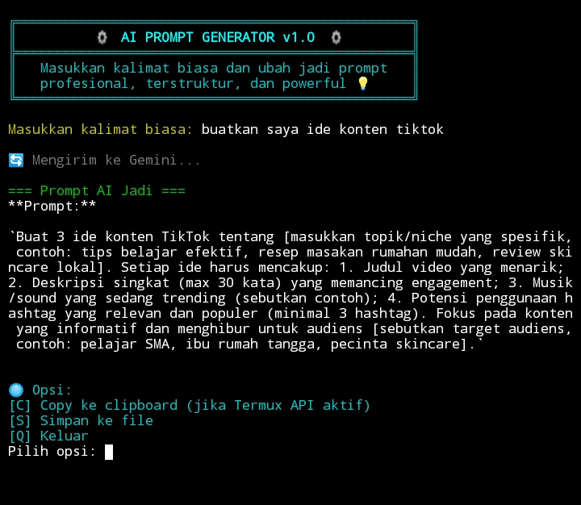

# ⚙️ PromptGen-Termux

Generate powerful, structured, and ready-to-use AI prompts langsung dari Termux.  
Cocok buat content creator, developer, dan siapa pun yang butuh prompt AI yang gak receh.  
Built for [Google Gemini API](https://ai.google.dev/), tampil keren, dan simple to use.

---

## ✨ Fitur Utama
- 🎯 Ubah input biasa jadi prompt AI profesional
- 💬 Tampilan UI minimalis dan futuristik di terminal
- 🔄 Mendukung copy to clipboard dan simpan ke file
- 🔌 Terintegrasi dengan Gemini API (by Google)

---

## 🚀 Cara Install
```bash
pkg update && pkg upgrade
pkg install git curl jq termux-api
git clone https://github.com/Armageddonz/promptgen-termux.git
cd promptgen-termux
bash promptgen.sh
```

---

## 🔐 Cara Dapatkan API Key Gemini (WAJIB!)

1. Buka [https://ai.google.dev/](https://ai.google.dev/)
2. Klik `Get API Key` atau langsung buka: [https://makersuite.google.com/app/apikey](https://makersuite.google.com/app/apikey)
3. Login pakai akun Google
4. Salin API Key kamu
5. Edit file `promptgen.sh` dan ganti bagian ini:

```bash
API_KEY="GANTI_DENGAN_API_KAMU"
```

✅ Done! Sekarang script kamu udah bisa jalan pakai akun sendiri.

---

## 📸 Tampilan


---

## 🧠 Credits
Dikembangkan oleh **Lawliet**, pelajar SMK TKJ yang haus akan teknologi AI dan terminal power-user.

---

## 📄 Lisensi
MIT License – bebas pakai, modifikasi, dan fork selama tetap mencantumkan kredit ke pembuat asli.
